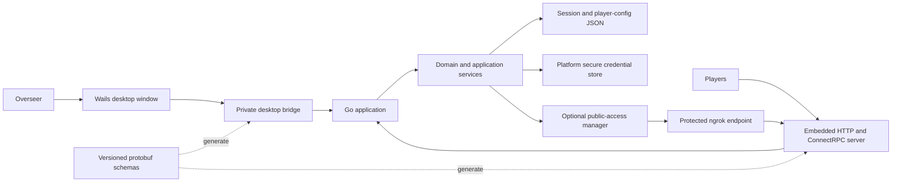
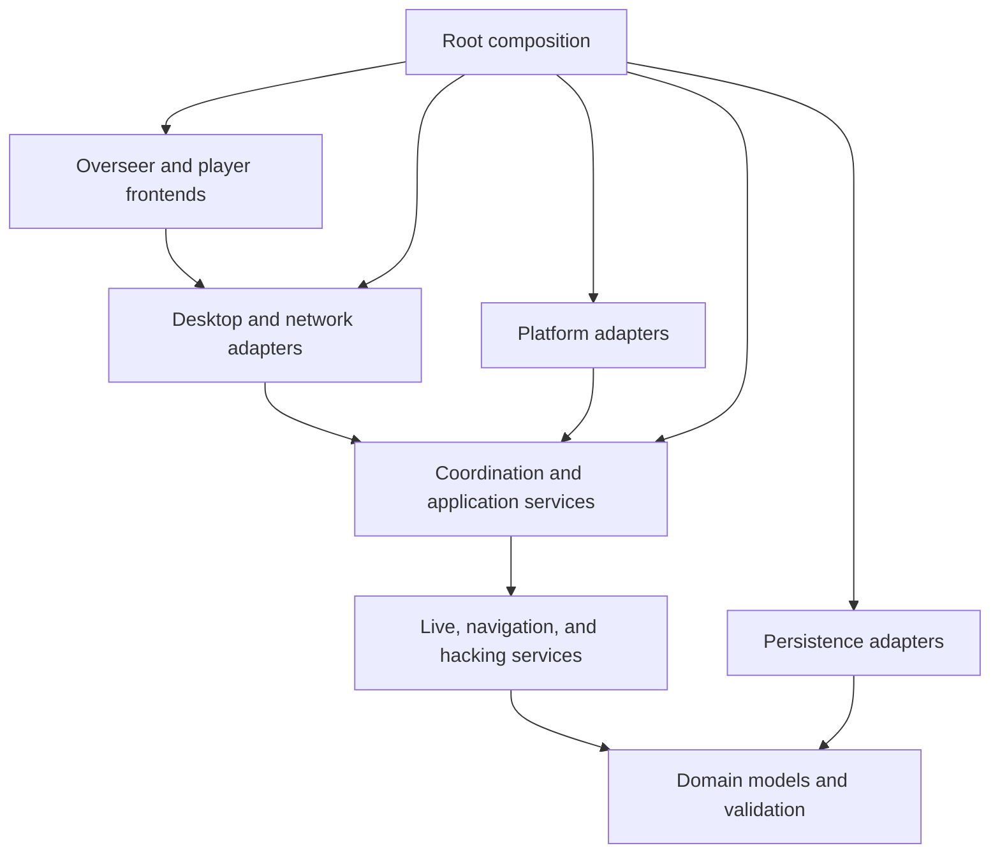
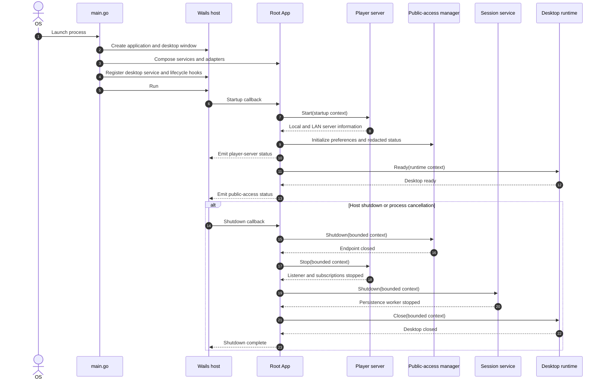
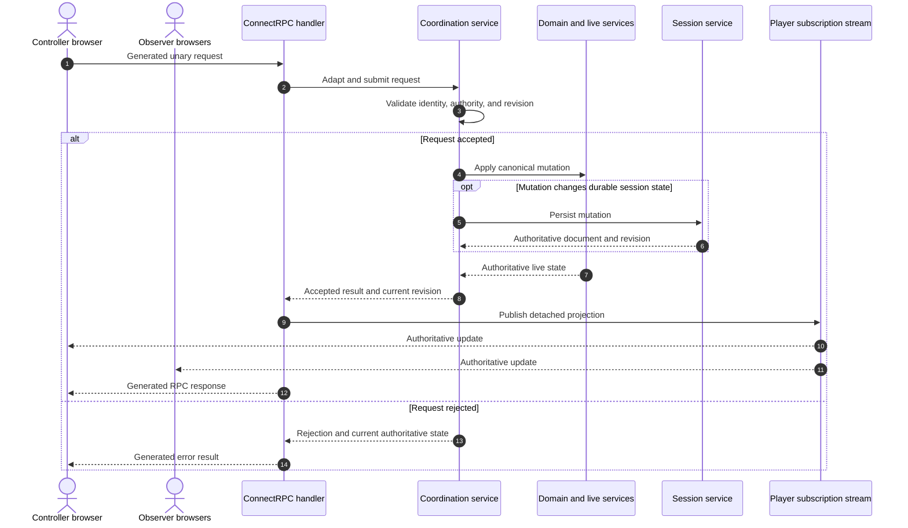
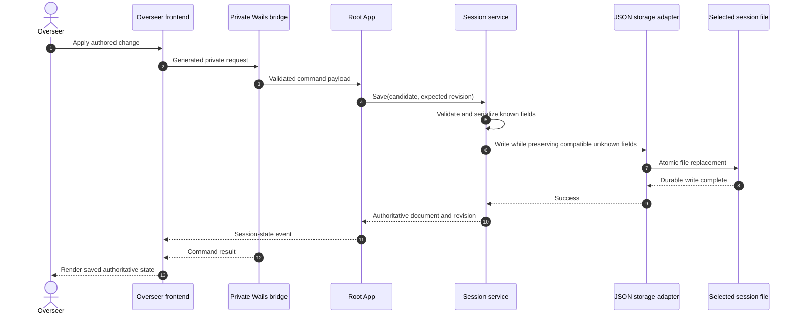
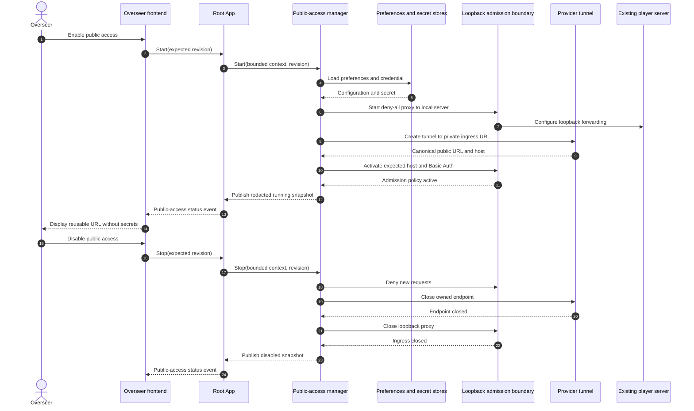

# Fallout Terminal Architecture

This document describes the current production architecture of Fallout Terminal. It is an
orientation guide for contributors: the project constitution remains the normative source for
architecture and engineering policy, while feature specifications record the decisions and
acceptance criteria for individual changes.

Related documents:

- [Project constitution](.specify/memory/constitution.md)
- [Platform support](docs/platform-support.md)
- [Build and packaging](docs/platform-packaging.md)
- [Feature specifications](specs/)

## System Overview

Fallout Terminal is a Go modular monolith packaged as a native Wails desktop application. The
same process hosts the trusted Overseer interface, application services, an embedded player HTTP
server, and optional public ingress. Players use a separate browser application served by that
embedded server.



The application has one authoritative process state. The desktop and player frontends are views
and command sources; neither frontend owns canonical shared gameplay state.

## Repository Structure

| Path | Responsibility |
|---|---|
| `/` | Application composition, Wails lifecycle, embedded assets, and the trusted desktop bridge |
| `internal/domain/` | Canonical domain models, validation, and stable JSON-facing representation |
| `internal/nav/` | Terminal navigation rules |
| `internal/hack/` | Hacking rules and word-bank behavior |
| `internal/live/` | Authoritative live terminal and hacking state |
| `internal/control/` | Coordination transactions, logical sessions, roster, controller authority, and ordered mutations |
| `internal/session/` | Versioned session persistence and durable command-state mutations |
| `internal/playerconfig/` | Player configuration persistence and selection workflows |
| `internal/player/` | Player assets, HTTP server, ConnectRPC adapters, subscriptions, and update delivery |
| `internal/tunnel/` | Public-access settings, secrets, ingress policy, ngrok lifecycle, and redaction |
| `internal/platform/` | Native dialogs, platform paths, secure credential stores, and OS-specific adapters |
| `internal/buildtool/` | Reproducible build, package, archive, and release orchestration |
| `internal/gen/` | Generated Go protobuf and ConnectRPC code; never edit manually |
| `frontend/overseer/` | Trusted Wails-hosted Overseer application |
| `frontend/client/` | Untrusted browser player application |
| `proto/` | Source-of-truth protobuf contracts and Buf configuration |
| `cmd/build/` | Repository-owned build and packaging command |
| `cmd/native-credential-smoke/` | Native secure-storage smoke-test command |
| `tests/browser/` | Playwright acceptance tests and the browser-test fixture server |
| `tools/` | Isolated Go modules that pin repository build tools |
| `scripts/` | Reproducible generation, validation, packaging, and smoke-test entry points |

Directories under `specs/` describe feature intent and history. They are not runtime modules.

## Runtime Composition

`main.go` creates the Wails application, embeds both built frontends, and calls the root
composition function. Composition constructs the services and adapters explicitly:

```text
Wails host
  -> platform adapters
  -> session and player-configuration services
  -> live-state service
  -> coordination service
  -> player ConnectRPC service and HTTP server
  -> public-access manager
  -> root App lifecycle
```

The root package is the composition boundary. Dependencies are passed through narrow interfaces;
domain and application services do not reach back into Wails globals.

The accepted desktop runtime is the exactly pinned Wails v3 version in `go.mod`. Node.js and Vite
build browser assets and generated bindings, but they are not separate production server
runtimes.

## Dependency Direction

The intended dependency direction is inward toward domain behavior:



Key constraints:

- `internal/domain/` must remain independent of Wails, ConnectRPC, ngrok, and generated transport
  types.
- Navigation, hacking, live-state, and coordination rules remain transport-independent.
- Transport handlers adapt generated messages to application services; handlers do not own domain
  rules or canonical mutable state.
- Wails objects and browser/runtime APIs remain in root composition or platform adapters.
- Public-access code must not become a second authoritative player server.

## Key Runtime Sequences

The diagrams below show ownership and ordering at the major system boundaries. They intentionally
omit implementation-only calls that do not affect authority, durability, or resource lifetime.

### Application Startup and Shutdown



Construction wires dependencies but does not acquire external resources. Startup owns listeners
and provider endpoints; shutdown releases them through explicit, bounded lifecycle calls.

### Authoritative Player Mutation and Publication



The browser does not commit shared state locally. Rejections return enough authoritative context
for the requester to discard stale drafts and converge without a second state owner.

### Trusted Session Update and Autosave



The selected path remains the autosave target. A successful UI result follows the session service's
durable mutation result rather than an optimistic frontend-only edit.

### Public Access Start and Stop



The public URL is published only after its authentication policy is active and is withdrawn when
the endpoint stops or fails. The provider forwards to the existing player server and never becomes
an independent state owner.

## Frontend Boundaries

The production frontend has exactly two Vue 3/strict-TypeScript ownership graphs. They share only
the `frontend/` npm install/lock boundary, pinned compiler/build tools, and capability-neutral base
compiler policy; they do not share application state, adapters, authored declarations, or a
runtime store.

| Application | Sole mount and entry | Bundle / consumer | Application boundary |
|---|---|---|---|
| Overseer | `#overseerApp` via `frontend/overseer/src/main.ts` | `frontend/overseer/dist`, embedded only by the private Wails host | Components and controllers depend on the typed `DesktopPort`; `frontend/overseer/src/adapters/desktop-api.ts` is the sole authored Wails binding/runtime consumer. |
| Player | `#playerApp` via `frontend/client/src/main.ts` | `frontend/client/dist`, served only by the public player HTTP server | Components and composables depend on Player-owned ports and generated public ConnectRPC clients; no Wails, private protobuf, Overseer, filesystem, credential, or native path exists. |

Each root has one mount owner and one teardown owner. Legacy/candidate mounts, shared callback
bridges, mixed DOM ownership, and handwritten production JavaScript entrypoints are absent. Local
Vue state may model drafts, focus, rendering, and pending requests, but it never creates a second
authority: Go remains the sole owner of shared gameplay, revisions, roles, approvals, persistence,
and trusted mutations. Observer input stays inert, controller requests remain revision-gated, and
both applications converge only from authoritative results/events/streams.

### Overseer

`frontend/overseer/` is the trusted native interface. It may invoke only the narrow desktop
service registered by the Go application and consume named application events. Wails-generated
bindings implement that private transport boundary behind `DesktopPort`.

The desktop bridge must not expose a generic dispatcher or arbitrary filesystem, process, or
environment access. Values received from the frontend are validated again at the privileged Go
boundary.

### Player

`frontend/client/` is a standalone browser application. It communicates with the embedded player
server through generated ConnectRPC clients and receives authoritative updates through server
streams. It has no Wails, native desktop, filesystem, credential, or private Overseer capability.

Player actions are requests. Go validates authority and revisions, applies accepted mutations,
and publishes the resulting state. The browser converges on that published state rather than
maintaining an independent canonical model.

## Contracts and Generated Code

Application-owned structured boundaries originate in versioned protobuf schemas under
`proto/fallout/terminal/`:

- `player/v1/` defines the public player service and state.
- `private/v1/` defines trusted desktop requests, results, events, and runtime projections.
- `persistence/v1/` defines known session and player-configuration fields.
- `config/v1/` defines serializable runtime and public-access configuration.

Buf generates Go code into `internal/gen/` and ECMAScript player contracts into
`frontend/client/gen/`. Wails generates private desktop bindings into
`frontend/overseer/bindings/`.

Generated files are build products checked for deterministic drift. Change the source schema or
registered Go service, run the repository generation task, and review the generated result; do not
patch generated files directly.

Public and private contracts stay separate at schema, handler, listener, and authorization
boundaries. Public player routes must never expose native dialogs, file access, provider
credentials, private hacking data, or trusted control operations.

## State and Persistence

The system has several explicit state owners:

| State | Owner | Lifetime |
|---|---|---|
| Session document and durable command state | `internal/session/` | Versioned JSON file |
| Player configuration | `internal/playerconfig/` | Versioned JSON file |
| Live terminal and hacking state | `internal/live/` | Process lifetime |
| Logical sessions, roster, controller, and coordination revisions | `internal/control/` | Process lifetime, with explicit durable seams |
| Public-access preferences | `internal/tunnel/` settings store | Application-support JSON |
| Public-access credentials | Platform secure credential store | OS-managed secret storage |
| Server, startup, and lifecycle status | Root `App` | Process lifetime |

Session JSON version 1 is a compatibility contract. Persistence adapters map known protobuf-owned
fields to the established JSON representation while preserving compatible unknown fields. The
project does not use a relational database or ORM.

Autosave targets the explicitly selected session file and uses the session service as the durable
mutation owner. Runtime-only connection, navigation, hacking, and tunnel state does not enter the
session document unless a feature explicitly evolves that contract.

## Player Server and Publication

`internal/player/` owns one in-process HTTP listener. It serves the built player assets and mounts
the generated ConnectRPC service. Unary RPCs carry portable browser mutations; server streams
publish detached authoritative projections.

The coordination service orders authority checks and mutations. After a successful state change,
the player service publishes an updated projection to connected clients. Delivery queues and
request sizes are bounded by runtime configuration.

Static HTML, CSS, fonts, sounds, and images use ordinary HTTP delivery. Structured application
messages use protobuf and ConnectRPC.

## Public Access

`internal/tunnel/` owns optional public access as an adapter around the existing player server:

1. Load non-secret preferences and credentials from separate stores.
2. Establish a protected provider endpoint and ingress policy.
3. Publish the public URL only after the complete authentication policy is active.
4. Forward accepted requests to the existing local player server.
5. Withdraw the URL and close the owned endpoint on stop, replacement, failure, or shutdown.

Public access is fail-closed and optional. Provider, network, account, or secure-storage failure
must not prevent local and LAN play. Status projections are redacted and never contain reusable
credentials.

## Lifecycle and Concurrency

The root `App` owns startup and shutdown ordering. Resource acquisition occurs during startup, not
construction. Services that own listeners, endpoints, workers, or platform resources expose
explicit shutdown boundaries and use bounded contexts where shutdown can block.

Tests register resource cleanup immediately with `t.Cleanup`. Cleanup operations that accept a
context derive it from `context.WithoutCancel(t.Context())` and add a bounded timeout when needed,
because the test context is canceled before cleanup callbacks run.

## Build and Deployment

The repository supports native packages for:

- macOS 13+ on Apple Silicon (`darwin/arm64`)
- Windows 10/11 (`windows/amd64`)
- Windows 11 on ARM (`windows/arm64`)
- Linux on the documented GTK4/WebKitGTK baseline (`linux/amd64` and `linux/arm64`)

The root `Taskfile.yml` is the development and verification interface. `Makefile` bootstraps the
pinned tools from isolated modules under `tools/`. The repository-owned `cmd/build` command
prepares protobufs, frontends, Wails bindings, native binaries, platform packages, and release
artifacts.

GitHub Actions separates macOS validation, cross-platform native builds, and portable release
assembly. GoReleaser publishes preverified artifacts; it does not compile the Wails application
for release.

## Verification Strategy

| Surface | Verification |
|---|---|
| Domain and application services | Colocated Go unit tests |
| Resource ownership and concurrency | Go race tests and lifecycle-focused tests |
| Public and private adapters | Go handler, contract, platform, and integration tests |
| Browser behavior | Playwright journeys under `tests/browser/` |
| Protobuf evolution | Buf formatting, linting, generation-drift, and breaking-change checks |
| Wails bridge | Deterministic binding and public-surface checks |
| Packaging | Platform package verification and native smoke tests |
| Repository policy | Tool-module, secret-leak, dependency-license, and cutover checks |

The root `.golangci.yml` explicitly defines the accepted Go linter baseline used by `task lint`.
The primary local quality gate is `task check`. Platform-specific packaging and native UI tests
add evidence that cannot be supplied by ordinary unit tests or cross-compilation.

## Changing the Architecture

Architecture-affecting work starts with a feature specification. A change should identify:

1. The canonical state owner and mutation authority.
2. Every producer, consumer, adapter, and generated contract affected.
3. Public versus private capability impact.
4. Persistence and backward-compatibility behavior.
5. Startup, shutdown, cancellation, and failure behavior.
6. Verification at unit, integration, browser, and platform boundaries.

When a migration completes, remove superseded active transports, dependencies, fixtures, and
instructions. Historical migration records may remain when they are clearly labeled and cannot be
mistaken for the current architecture.
