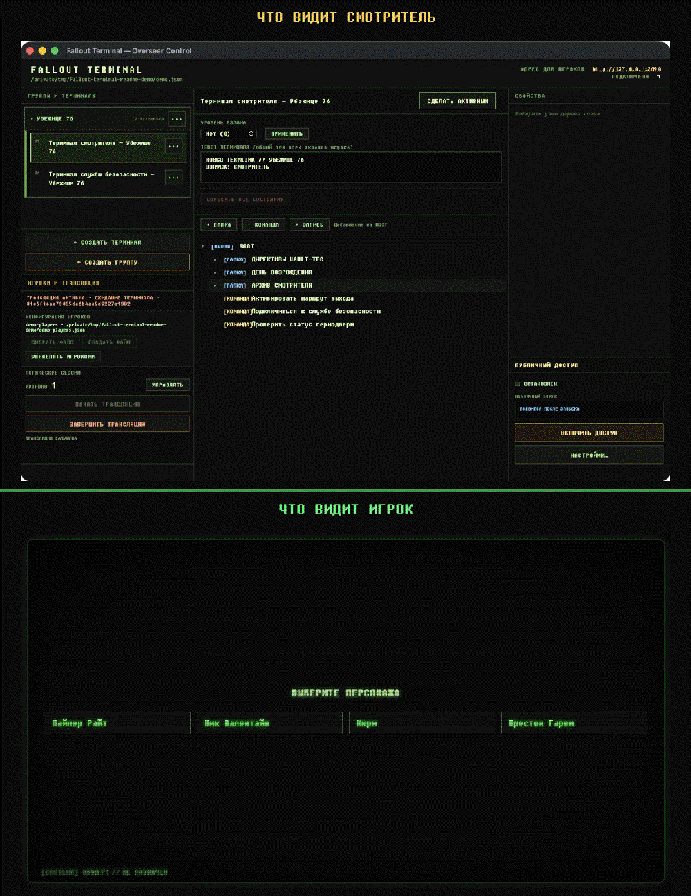

# Fallout Terminal

Приложение для настольных RPG: смотритель создаёт терминалы в нативном настольном приложении, а игроки открывают общий Fallout-style интерфейс в браузере. Навигация, взлом, роли игроков и состояние терминала синхронизируются сервером внутри приложения.

Поддерживаются macOS 13+ на Apple Silicon, Windows 10/11 и Linux на `amd64` и `arm64`. Системные требования и расположение данных приведены в [руководстве по платформам](docs/platform-support.md).

## Скачать и запустить

На [странице последнего выпуска](https://github.com/obalunenko/Fallout-Terminal/releases/latest) выберите архив для своей ОС и архитектуры:

| Платформа | Архив | Запуск после распаковки |
|---|---|---|
| `windows/amd64` | `Fallout-Terminal-windows-amd64.zip` | `Fallout Terminal.exe` |
| `windows/arm64` | `Fallout-Terminal-windows-arm64.zip` | `Fallout Terminal.exe` |
| `linux/amd64` | `Fallout-Terminal-linux-amd64.tar.gz` | `./Fallout Terminal` |
| `linux/arm64` | `Fallout-Terminal-linux-arm64.tar.gz` | `./Fallout Terminal` |
| `darwin/arm64` | `Fallout-Terminal-darwin-arm64.zip` | `Fallout Terminal.app` |

Полностью распакуйте архив, не отделяя приложение от ресурсов. Пошаговые инструкции находятся в [RUNNING.md](RUNNING.md). Версионированные portable-пакеты проверяют обновления один раз за запуск и устанавливают их только с согласия пользователя; сессии и настройки при этом не изменяются.

## Возможности

- несколько терминалов в одной автоматически сохраняемой JSON-сессии;
- меню из папок, текстовых записей и команд;
- один активный контроллер, наблюдатели и восстановление экрана после переподключения;
- пять уровней Fallout-style взлома и специальные скобочные последовательности;
- команды, изменения состояния и переходы между терминалами;
- локальный доступ без внешних сервисов;
- опциональная защищённая публичная ссылка через ngrok.

## Демонстрация



Сверху показан интерфейс смотрителя, снизу — общий экран игроков: навигация, команды, переходы и взлом синхронизируются в реальном времени.

[Demo-сессия](sessions/demo.json) показывает все типы содержимого, а [demo-players.json](sessions/demo-players.json) содержит готовых игроков. Для редактирования создайте копию demo-файла.

## Как настроить терминал

1. Создайте новую session JSON или откройте существующую. После выбора файла изменения сохраняются автоматически и атомарно.
2. Нажмите **+ Новый терминал**, задайте ему имя, уровень взлома `0–5` и необязательный общий текст, затем нажмите **Применить**.
3. Соберите меню кнопками **+ Папка**, **+ Запись** и **+ Команда**. Перед добавлением выберите `ROOT` или нужную папку — новый элемент появится внутри неё.
4. Выберите элемент дерева, заполните его свойства справа и нажмите **Применить**:
   - **Папка** группирует вложенные пункты меню;
   - **Запись** открывает игрокам текст;
   - **Команда** выполняет действие согласно выбранному режиму.
5. Для каждой команды выберите ровно один режим:
   - **Обычная команда** сразу показывает заданный результат;
   - **Изменяет состояние** запрашивает решение смотрителя и после одобрения сохраняет новое название и результат до явного сброса;
   - **Переход в другой терминал** запрашивает решение смотрителя, активирует выбранный терминал и добавляет на его корневой экран возврат назад.

Целью перехода может быть только другой существующий терминал. Удалить терминал, на который ещё ссылается команда, нельзя. Чтобы изменить режим уже выполненной команды с состоянием, сначала нажмите **Сбросить состояние**.

### Группы терминалов

Терминалы можно объединять в упорядоченные группы, менять их порядок и переносить между группами. Переходы вперёд и назад работают внутри группы и требуют подтверждения смотрителя.

## Как провести игру

1. Выберите или создайте player-config, добавьте персонажей и нажмите **Начать трансляцию**.
2. Выберите терминал и нажмите **Сделать активным**. Для последующих правок активного терминала используйте **Обновить у игроков**.
3. Отправьте игрокам адрес из верхней панели.
4. Одобряйте или отклоняйте команды с изменением состояния и переходы. Пока решение ожидается, навигация игроков заблокирована.
5. После игры нажмите **Завершить трансляцию**. Временный маршрут, подключения и взлом очистятся, а одобренные состояния команд останутся в session JSON.

### Управляющий и наблюдатели

В трансляции может быть только один управляющий — активный игрок, который управляет общим экраном, открывает записи, выполняет команды и проходит взлом. Первый подключённый игрок с назначенным персонажем становится управляющим; остальные игроки получают роль наблюдателя и видят тот же экран без возможности управлять им.

Чтобы передать управление, в панели **ИГРОКИ И ТРАНСЛЯЦИЯ** откройте **ЛОГИЧЕСКИЕ СЕССИИ → УПРАВЛЯТЬ**, найдите подключённую сессию с назначенным персонажем и нажмите **СДЕЛАТЬ УПРАВЛЯЮЩИМ**. Новый игрок сразу получает управление, а прежний становится наблюдателем.

При отключении управляющего его роль сохраняется и автоматически никому не передаётся. Смотритель может дождаться переподключения или назначить управляющим другого подключённого игрока с персонажем.

## Взлом терминала

Уровни 1–5 используют слова длиной от 4 до 8 символов и дают четыре попытки. Последовательности `()`, `[]`, `{}` и `<>` удаляют неверный вариант или восстанавливают попытки. Состояние взлома синхронизируется между игроками и восстанавливается при переподключении.

## Локальный и публичный доступ

Локальный сервер на порту `3690` запускается вместе с приложением и работает без интернета.

Для внешней ссылки откройте в приложении раздел **Публичный доступ**:

1. укажите личный ngrok authtoken;
2. задайте имя и пароль для игроков;
3. при необходимости укажите доступный вашему аккаунту фиксированный домен;
4. сохраните настройки и нажмите **Включить**.

Если поле домена пустое, ngrok назначит [автоматический домен](https://ngrok.com/docs/gateway/domains/#auto-assigned-domains). Заполненный [фиксированный домен](https://ngrok.com/docs/gateway/domains/#domains) должен быть доступен вашему аккаунту.

Публичный endpoint защищает статические файлы и RPC одной парой Basic Auth. Authtoken и пароль хранятся только в системном защищённом хранилище — macOS Keychain, Windows Credential Manager или Linux Secret Service — и не попадают в session JSON, player-config или публичное состояние. Недоступное или заблокированное хранилище отображается как безопасная ошибка без записи секрета в обычный файл; локальная игра продолжает работать. Ошибка ngrok также не мешает локальной игре.

## Сессии и данные

- Session JSON сохраняется по явно выбранному пути; новые файлы по умолчанию предлагаются в системном каталоге Documents внутри `Fallout Terminal/Sessions/`.
- Player-config хранит ID и имена персонажей отдельно от сессии.
- Одобренные состояния команд сохраняются; подключения, роли, активная трансляция и текущий взлом — нет.

Перед экспериментами делайте копии важных сессий.

## Разработка

Проект использует Go, Wails `v3.0.0-beta.15` и Task `v3.53.1`. Требуются:

- Go 1.27.x;
- ровно Node.js 26.8.1 и npm (другая версия отклоняется `task node:check`);
- нативные компоненты сборки из [руководства по платформам](docs/platform-support.md).

Frontend состоит из двух независимых Vue 3 приложений на строгом TypeScript: нативный приватный
Overseer монтируется в `#overseerApp`, публичный браузерный Player — в `#playerApp`. У них отдельные
исходники, состояния, адаптеры и production bundles. Overseer обращается к Wails только через
типизированный `DesktopPort`; Player использует только публичные ConnectRPC protobuf-контракты.
Пять Player-модулей `*_pb.ts` генерируются из `proto/` и не редактируются вручную.

Зависимости обоих приложений устанавливаются один раз из workspace `frontend/` по единственному
`frontend/package-lock.json`:

```bash
nvm use
task node:check
npm ci --prefix frontend
```

Установите закреплённые Go-инструменты и запустите приложение:

```bash
make help
make tools
task dev
```

`task dev` устанавливает frontend-зависимости, проверяет контракты, собирает приложение и открывает окно смотрителя. Основные команды:

```bash
task --list   # все задачи
task build    # сборка для текущей ОС
task package  # portable-пакет для текущей ОС
task test     # Go-тесты
task check    # основные локальные проверки
```

`make tools` устанавливает инструменты из `tools/*/go.mod`; остальные операции выполняются через `Taskfile.yml`. `task package:all` опционально собирает локальную матрицу через macOS и Docker. События pull requests и push в `main` запускают read-only проверки, а push подходящего SemVer tag — нативную сборку и публикацию пяти архивов. Полные команды упаковки и релиза приведены в [руководстве по сборке и выпуску](docs/platform-packaging.md).

### Дополнительные проверки

```bash
task frontend:typecheck:overseer
task frontend:typecheck:client
task frontend:typecheck
task frontend:build:overseer
task frontend:build:client
task frontend:build
task frontend:compatibility:check
task frontend:boundary:check
task frontend:policy:check
task frontend:reproducible:check
task proto:check
task proto:breaking
task bindings:check
task browser:test
```

Это полный набор из десяти канонических frontend-целей Taskfile. Индивидуальные type-check/build
цели не переустанавливают зависимости; агрегатная `frontend:build` владеет чистой установкой.
Playwright и снимки дают только браузерные свидетельства. Нативные Wails/embed/resource проверки и
проверки пакетов выполняются отдельно; недоступный хост, Accessibility, credentials, signing или
notarization записываются как `NOT RUN`, а не заменяются браузерным результатом.

### Spec Kit

Для спецификаций нужны Python 3.11+ и [uv](https://docs.astral.sh/uv/getting-started/installation/):

```bash
task speckit:install
task speckit:update:check
```

## Структура проекта

- `frontend/overseer/` — интерфейс смотрителя (Overseer);
- `frontend/client/` — браузерный интерфейс игроков;
- `internal/` — домен, хранение, live-state и сервер игроков;
- `proto/` — protobuf-контракты;
- `sessions/` — встроенные примеры session JSON;
- `tests/browser/` — браузерные сценарии;
- `specs/` — спецификации реализованных возможностей.

## Документация проекта

- [Архитектура](ARCHITECTURE.md) — границы модулей, владельцы состояния и основные runtime-последовательности;
- [Участие в разработке](CONTRIBUTING.md) — настройка окружения, правила изменений и проверки;
- [Руководство Wails v3](specs/006-wails-v3-migration/quickstart.md) — активные команды и проверки desktop-host;
- [Откат Wails v3](docs/wails-v3-migration-rollback.md) — активная процедура возврата на Wails v2;
- [Исторический откат Electron → Wails v2](docs/wails-migration-rollback.md) — сохранённое свидетельство завершённой миграции;
- [Политика безопасности](SECURITY.md) — поддерживаемые версии и приватная отправка отчётов об уязвимостях.

## Происхождение

Проект основан на [Hobbit041/Fallout-Terminal](https://github.com/Hobbit041/Fallout-Terminal) и после миграции с Electron на Go/Wails развивается самостоятельно. Атрибуция приведена в [NOTICE.md](NOTICE.md).

## Лицензия

Проект распространяется по [лицензии MIT](LICENSE). Сведения о происхождении и атрибуции приведены в [NOTICE.md](NOTICE.md).

Это неофициальный фанатский проект, не связанный с Bethesda Softworks и ZeniMax Media и не одобренный ими. Права на Fallout принадлежат их правообладателям.
